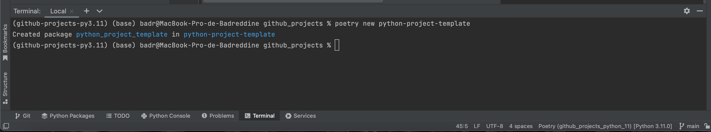

# Create new python project
## Create the project structure

* Open the terminal and change the current working directory to your local project.
* Create the project folder using poetry:
```
poetry new python-project-template
```


## Create the poetry interpreter
* Step 1: Add new local interpreter

* Step 2: Create a new poetry interpreter

  * Step 3: Rename the newly created poetry interpreter
  
  
        venv location: /Users/badr/Library/Caches/pypoetry/virtualenvs/github-projects-SNtUKpNA-py3.11/bin
  
## Install the requirements using poetry:
* poetry add sklearn
* poetry add pandas
* ...

## Automatic format of the python code

* Install ```black``` package:

```bash
poetry add black
```
* How to use?

  Either to open a terminal and write:
```bash
black python_script_name.py
```
or if we want to format more than one python file, write :
```bash
black folder_name/
```
or using pre-commit automatic formatting:
* First, we need to install not only black but also pre-commit package:
```bash
poetry add pre-commit
```
* Create a new file and name it: ```.pre-commit-config.yaml```
* Write in the file the following code, make sure you are choosing your 
current python version ```python --version```:
```
repos:
-   repo: https://github.com/psf/black
    rev: stable
    hooks:
    - id: black
      language_version: python3.11.0
```
* Install pre-commit, meaning, create a new hook for the yaml file. 
Using the terminal, change the current working directory to your local project 
(where the yaml file is created and then execute:
```
pre-commit install
```
